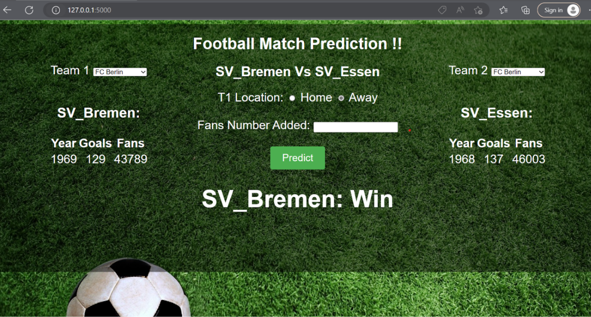

**# To integrate App Engine with BigQuery for predictive modeling, you can follow these steps:
- Create a project in Google Cloud Console and enable the App Engine and BigQuery APIs.
- Create a BigQuery dataset and table to store your data for training your predictive model.
- Prepare your data for training. This may involve cleaning the data, transforming it into the appropriate format, and splitting it into training and testing datasets.
- Train your predictive model using a machine learning library or framework like TensorFlow, scikit-learn, or PyTorch. You can use the data you prepared in step 3 as input to your model.
- Once your model is trained, you can deploy it to App Engine. You may want to use a framework like Flask or Django to build a web interface for your model.
- To make predictions using your deployed model, you can send HTTP requests to your App Engine application with the data you want to predict on. Your App Engine application can then use the BigQuery API to retrieve any necessary data from your BigQuery table and make predictions using your deployed model.
- Football Match Prediction application:
  
